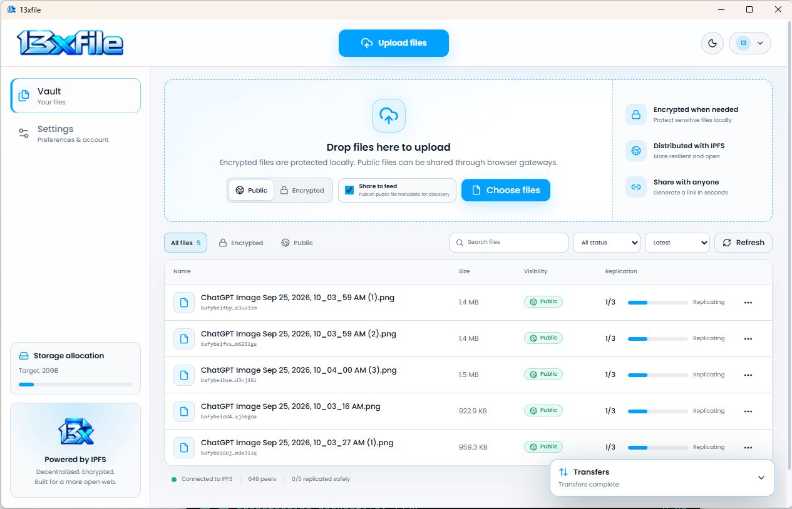
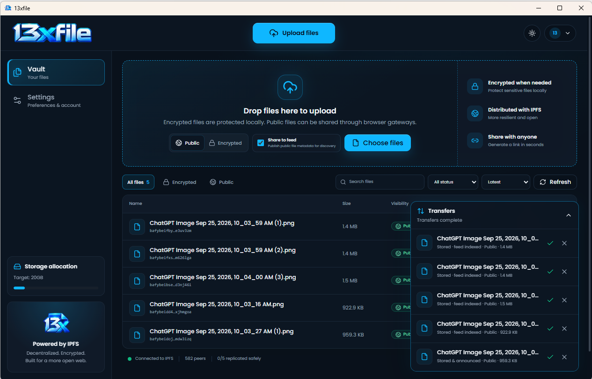
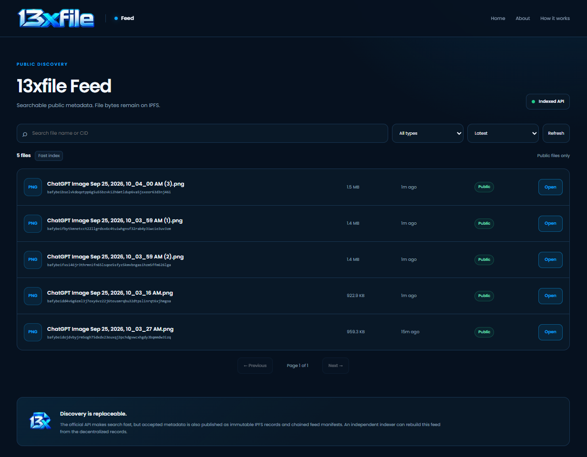
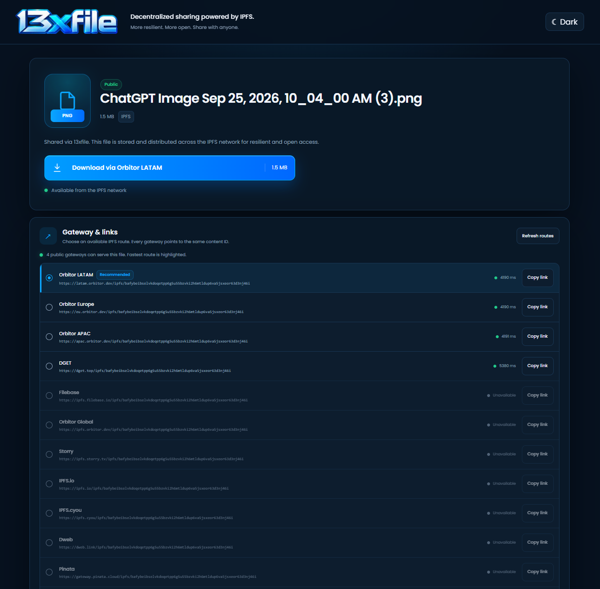

# 13xfile

13xfile is a decentralized encrypted storage network built around content-addressed IPFS blocks, signed device metadata operations, and independent storage peers.

## Interface preview

### Desktop

The desktop client supports public and encrypted uploads, optional **Share to feed** publishing, IPFS replication status, transfer tracking, browser sharing, and local-first vault management.

| Light theme | Dark theme |
| --- | --- |
|  |  |

### Feed and public sharing

The public feed provides searchable discovery for files explicitly published from the desktop app, while the share page gives public files a browser-friendly download experience.

| Public feed | Share page |
| --- | --- |
|  |  |

## MVP layout

```text
13xfile/
├── node/       headless storage peer
├── desktop/    standalone desktop application
├── web/        main centralized product website (13xfile.app)
├── feed/       public feed frontend (feed.13xfile.app)
├── share/      static public-file receiver page (share.13xfile.app)
├── api/        replaceable feed discovery/index API (api.13xfile.app)
└── docs/
```

13xfile does not use a central storage API for file bytes. The optional feed service is a centralized discovery/indexing convenience layer only: public file metadata is stored on IPFS, feed manifests are chained on IPFS/IPNS, and the SQLite index can be rebuilt or replaced.

## MVP protocol

Each device has its own Ed25519 device identity. Vault metadata is represented as signed append-only operations such as:

- `file.add`
- `file.remove`
- `replica.ack`

A replica is counted only after a distinct device signs a receipt after completing its IPFS pin **and** that device has a recent signed heartbeat. The desktop therefore shows active `n / target` durability instead of inferring replicas from CID/provider announcements or counting an offline device forever.

IPNS is still used as the mutable discovery pointer for the merged vault operation log. The current MVP retains the shared vault publishing key derived from the recovery code; replacing that final shared writer with a stronger multi-writer discovery layer remains post-MVP work.

## Private files

New private uploads use:

1. a random 256-bit per-file key;
2. chunked AES-256-GCM encryption before IPFS;
3. a vault-derived AES-GCM key-wrap around the random file key.

Storage peers only need the encrypted CID and wrapped-key metadata. They do not need the plaintext file key.

Older private files from the first prototype remain readable through the legacy deterministic-key fallback.

## Desktop MVP

The Wails desktop client owns its own node and Kubo runtime. Current features include:

- create/join vault onboarding and recovery-code reminder
- drag/drop and multi-file uploads
- three concurrent transfer workers
- persistent transfer journal and restart recovery
- Google Drive-style transfer tray
- public-by-default uploads with optional local encryption
- signed replica receipts and configurable replication target
- file details with individual device receipts
- search
- native save-to-download-folder
- signed metadata removal/tombstones
- system tray / close-to-background behavior
- optional start-at-login
- configurable storage allocation
- public HTTPS sharing
- selectable independent public-IPFS download mirrors
- `x13file://` app-share deep-link support
- legacy `13xfile://` link parsing
- optional “Share to feed” metadata publishing through the separate feed index API

See `desktop/README.md`.

### Local development with Docker

The web surfaces and feed infrastructure are Dockerized for local testing. No one-time setup script or production deployment is required.

Requirements:

- Docker Desktop with Docker Compose
- Go and Node.js only for running/building the native desktop app

Start the local web/feed stack from the repository root:

```powershell
.\\pages.cmd
```

That is a convenience wrapper for:

```powershell
docker compose up --build
```

It starts:

```text
Main      http://127.0.0.1:8080/
Feed      http://127.0.0.1:8081/
Share     http://127.0.0.1:8082/
Feed API  http://127.0.0.1:8090/health
IPFS      internal Docker service
```

The local feed API keeps its SQLite index and Kubo repository in Docker named volumes, so data survives container recreation.

In a second terminal, run the native desktop app:

```powershell
.\\dev.cmd -NoPull
```

Development desktop runs default **Share to feed** submissions against `http://127.0.0.1:8090`. The Windows dev launcher also stops an older installed/dev 13xfile desktop process before starting the current checkout, preventing the single-instance handoff from silently returning you to an outdated executable. Set `FEED_API_URL` explicitly only when you intentionally want a different feed service.

Stop the attached Docker stack with `Ctrl+C`. To remove stopped containers/networks use:

```powershell
docker compose down
```

To also wipe the local feed database and Docker IPFS repository:

```powershell
docker compose down -v
```

### Pull latest changes

From the repository root on Windows:

```powershell
.\\pull.cmd
```

This safely fast-forwards `main` from `origin/main`. It discards only generated `desktop/frontend/dist` output from previous local builds and refuses to pull when real source changes are present.

### Windows development helper

From repository root, run:

```powershell
.\\dev.cmd
```

It safely fast-forwards `main`, installs frontend dependencies when needed, rebuilds the desktop frontend, then starts the Wails desktop app with `go run .`.

Useful options:

```powershell
.\\dev.cmd -BuildOnly     # pull + build, do not launch
.\\dev.cmd -NoPull       # build/run current checkout without pulling
.\\dev.cmd -CleanInstall # force npm ci before building
```

The updater automatically discards generated `desktop/frontend/dist` changes from prior local builds, but still refuses to pull when real source files have uncommitted changes or the current branch is not `main`.

## Headless node

`13xfile-node` is the always-on/server peer. It self-manages a pinned Kubo runtime, keeps an isolated IPFS repository, follows vault metadata, pins learned CIDs, and publishes signed replica receipts after successful storage.

See `node/README.md`.

## Remaining MVP limitations

- IPNS discovery still uses shared recovery-code publishing authority.
- Every joined peer currently attempts to replicate every vault file; storage placement/leases are not yet selective.
- Private browser sharing is intentionally deferred.
- Public browser sharing currently uses a temporary static-page hosting path until share.13xfile.app is deployed.
- Feed publisher metadata is not yet cryptographically signed by the desktop device; the v1 record format reserves a signature field for that next step.
- Mobile remains deferred until the desktop/node protocol settles.
